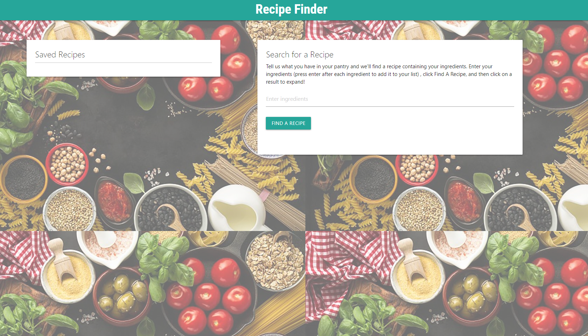
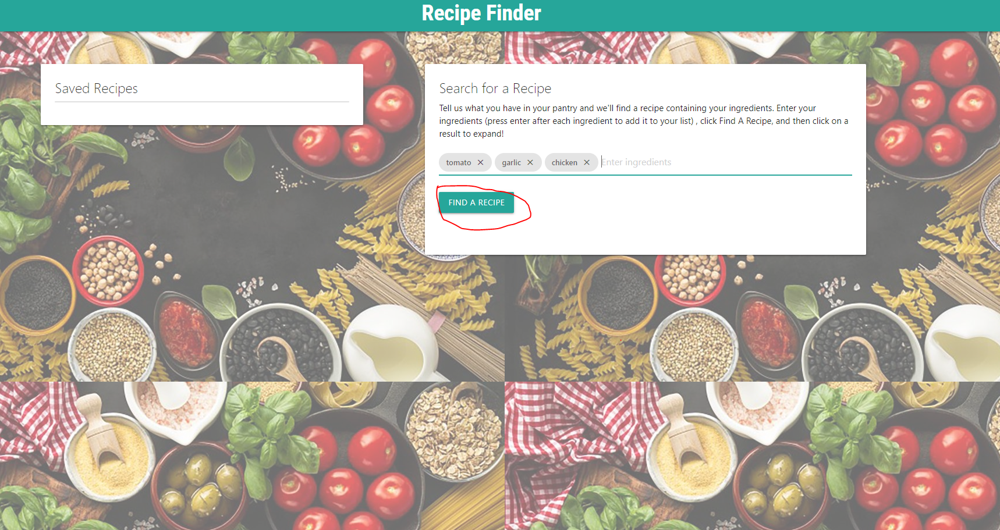
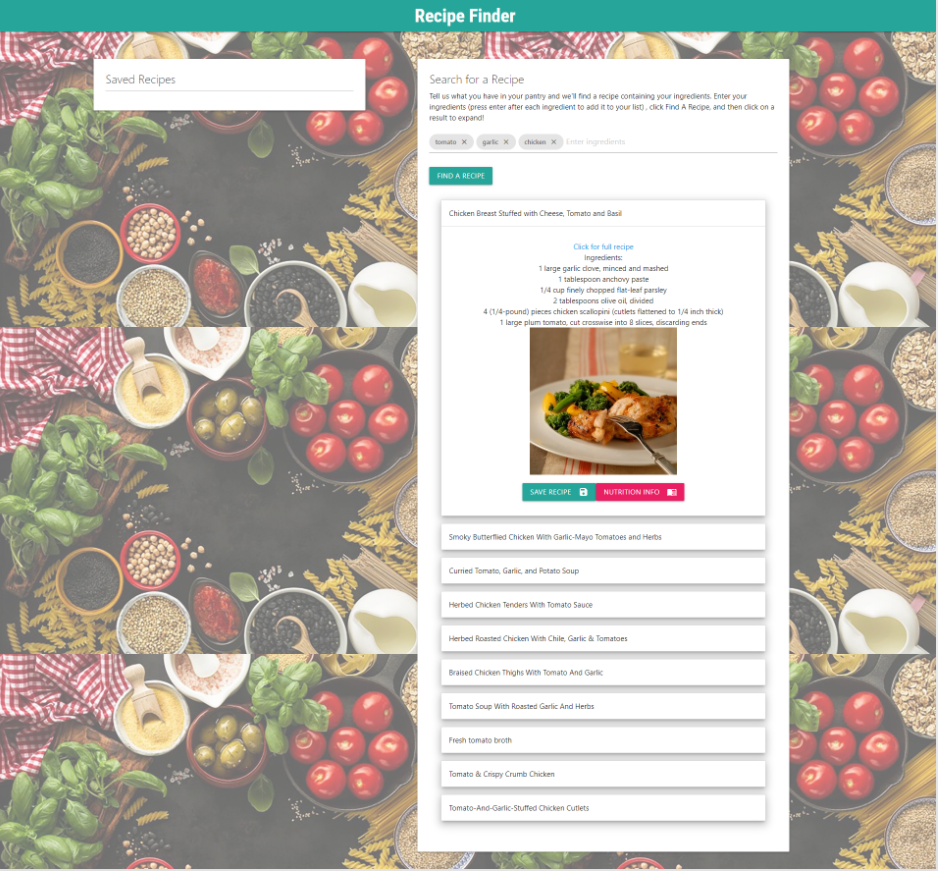
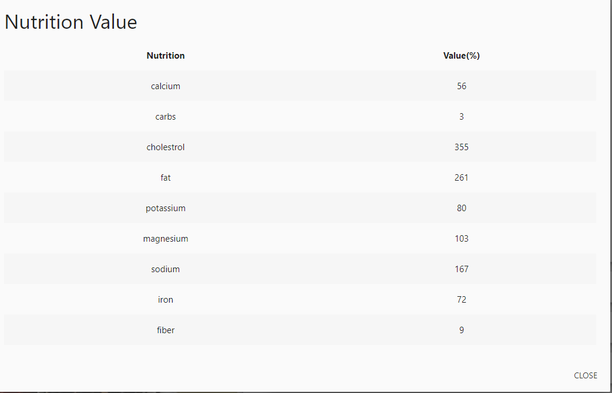
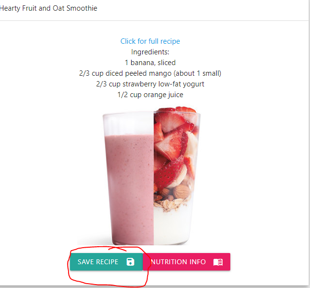
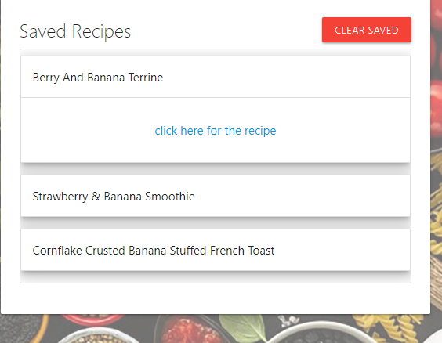

## Recipe Finder

### user Story

**IDEA:** Recipe generator based on available ingredients

**WHEN:** I am a hungry person wanting a meal

**WHEN:** I don't know what I can make with what I have

**I WANT:** To find recipes I can make

**AND:** See what those recipes look like

**SO THAT:** I can make a meal with the instructions provided based on the ingredients I have

---------------------------------------------------------------------------------------------------------------------------

### Developers:

[Vinitha Kumar](https://github.com/selvivini)

[Carly Gouge](https://github.com/cgouge93)

[Justin Yates](https://github.com/justinyates887)

---------------------------------------------------------------------------------------------------------------------------

### Description:

A responsive website utilizing [Materialize](https://materializecss.com/) framework and API's from [Edamam](https://developer.edamam.com/edamam-docs-recipe-api)

The goal is to provide a website where a user can input the ingredients they have on hand and will be given a list of recipes they can make as well as images,recipelink and the list of ingredients of said recipe underneath.Each recipe also shows the nutrition value of the recipe. The user also has an option to save the recipe link where the recipe title and recipe links are stored in local storage and the result is persistent all the time unless the user clears it. The styling of the website is done using materialize css and it is responsive across all width ports.

--------------------------------------------------------------------------------------------------------------------------------

## Mockup

## Github pages
[Deployed Project](https://cgouge93.github.io/recipe-website/)
